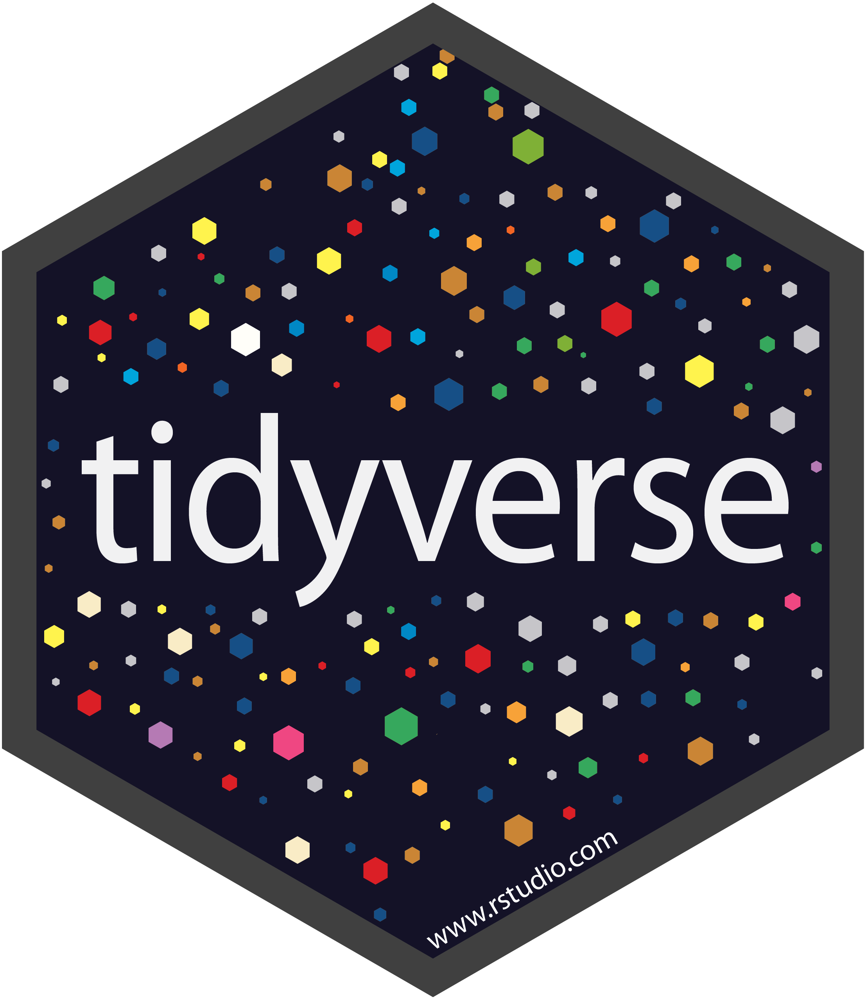
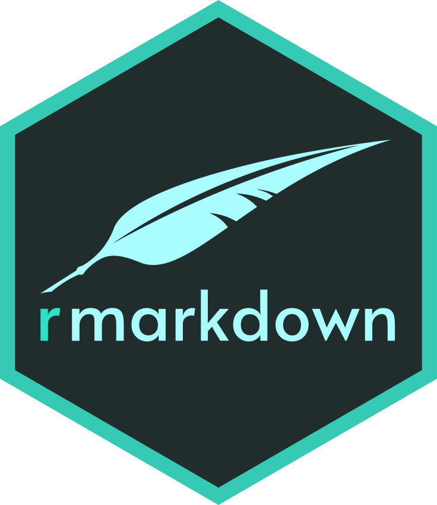
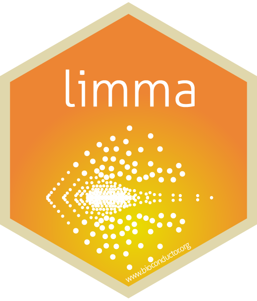
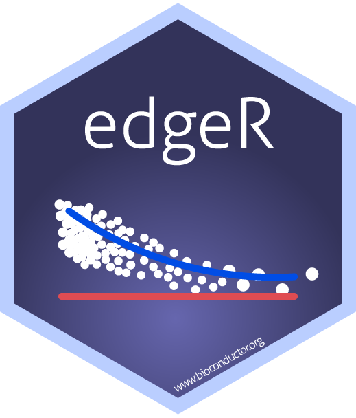
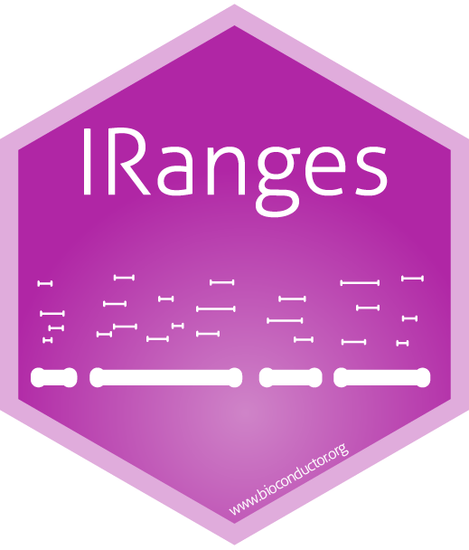
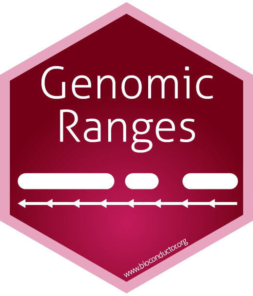
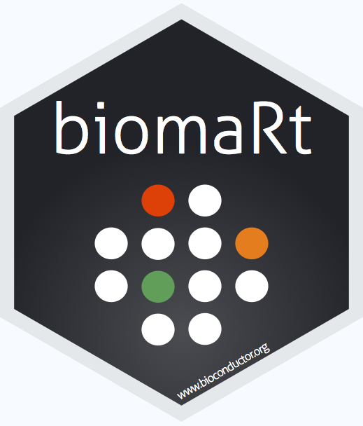
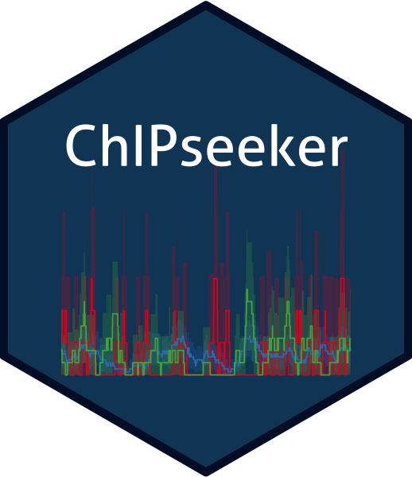

<!-- inicio academic icons -->
<link rel="stylesheet" href="https://cdn.jsdelivr.net/gh/jpswalsh/academicons@1/css/academicons.min.css">
<!-- final academic icons -->

 
<!-- inicio font awesome -->
<script src="https://kit.fontawesome.com/1f72d6921a.js" crossorigin="anonymous"></script>

 
<!-- final font awesome -->

```{r, include=FALSE}
knitr::opts_chunk$set(
  results='asis', 
  echo = FALSE
)

library(magrittr) # For the pipe
source("CV_printing_functions.R")

# Read in all data and initialize a CV printer object
CV <- create_CV_object(
  data_location = "C:/Users/afradera/Desktop/LocalGit/CV/data/",  
  pdf_mode = params$pdf_mode
)
NET <- create_network_object(
  data_location = "C:/Users/afradera/Desktop/LocalGit/CV/data/",  
  pdf_mode = params$pdf_mode
)
```


```{r}
# When in pdf export mode the little dots are unaligned, so fix that with some conditional CSS.
if(params$pdf_mode) {
    cat("
<style>
:root{
  --decorator-outer-offset-left: -6.5px;
}
</style>")
}
```


# Aside

{.avatar}

## Contact {#contact}

```{r}
# CV %>% print_contact_info()
```

-  <i class="fa fa-home"></i> [AFraderaSola](https://afraderasola.github.io/)

-  <i class="fa fa-envelope"></i> afraderasola@gmail.com

-  <i class="fa fa-phone"></i> +49 179 3469988

-  <a href='https://github.com/AFraderaSola' target='_blank'><i class="fa fa-github"></i></a> <a href='https://orcid.org/0000-0002-4780-9312' target='_blank'><i class="fab fa-orcid"></i></a> <a href='https://scholar.google.com/citations?view_op=list_works&hl=en&user=S0Hv4nUAAAAJ&gmla=AJsN-F7dv2Hh8UVQkxzPARPrR0TmHbHUFnlDDTqu3XSoAs8pjvmln4KlGq0KmOqv-nh01QC5a-8fNgQI76bZqElaMr7oE4mDr_Mp4NUpaGQI_jakncCYIJPGM_KYNo1mOhdEP0FuJc3Y' target='_blank'><i class="ai ai-google-scholar"></i></a> <a href='https://twitter.com/AFraderaSola' target='_blank'><i class="fa fa-twitter"></i></a>  <a href='https://stackoverflow.com/users/9634765/a-fraderasola' target='_blank'><i class="fa fa-stack-overflow"></i></a> 

<!-- <a href='https://www.imb.de/research/butter/research' target='_blank'><i class="fa fa-link"></i></a> workwebsitelink -->

```{r}
if(params$pdf_mode){
  # cat("View this CV [online](https://github.com/AFraderaSola/CV/blob/master/cv.html)")
  cat("\n")
} else {
  cat("<i class='fas fa-download'></i> Download this CV in [PDF](https://github.com/AFraderaSola/CV/blob/master/cv.pdf)")
}
cat("\n", fill = T)
cat("__Language Skills__", fill = T)
cat("\n", fill = T)
print_language_skills(CV)
cat("\n", fill = T)
cat("__My CV as a network__")
```


```{r}
# Build interactive network of positions colored by section
# and connected if they occurred in the same year
build_network_logo2(NET$entries_data)
cat("\n", fill = T)
cat("Bullet points (for <i class='fa fa-graduation-cap' style='color:#A6CEE3'></i>, <i class='fa fa-flask' style='color:#1F78B4'></i>, <i class='fa fa-book' style='color:#B2DF8A'></i>, and <i class='fas fa-chalkboard-teacher' style='color:#33A02C'></i>) are interconnected by year. Interactive version [here](https://afraderasola.github.io/project/cvnetwork/)")
```


# Main

## Albert Fradera Sola {#title}

### Bioinformatician \| Data Scientist \| Proteomics & Genomics Scientist

```{r}
# Note the special double pipe so we modify the CV object in place
CV %<>% print_text_block("intro") 
```


## Education {data-icon=graduation-cap data-concise=true}

```{r}
CV %<>% print_section('education')
```


## Research Experience {data-icon=flask}


```{r}
CV %<>% print_section('research_positions')
```

\pagebreak

::: aside

```{r, message=F, warning=F}
cat("__Coding Skills__", fill = T)
cat("\n", fill = T)
CV %>% print_skill_bars()
cat("\n", fill = T)
cat("Some R packages I have experience with:", fill = T)
cat("\n", fill = T)
```















```{r, message=F, warning=F}
cat("__Proteomics Software Skills__", fill = T)
cat("\n", fill = T)
CV %>% print_proteomics_skills()
cat("__Genomics Software Skills__", fill = T)
cat("\n", fill = T)
CV %>% print_genomics_skills()
```

:::

## Dry Lab Projects and Related Skills {data-icon=laptop}

```{r}
CV %<>% print_section('dry_skills')
```


## Wet Lab Projects and Related Skills {data-icon=vial}

```{r}
CV %<>% print_section('wet_skills')
```

\pagebreak

::: aside

```{r, message=F, warning=F}
cat("__Abstract word cloud__", fill = T)
cat("\n", fill = T)
print_wordcloud(CV)
cat("\n", fill = T)
cat("Abstracts from the publications are summarized into a word cloud.", fill = T)
```

:::

## Publications {data-icon=book}

```{r}
CV %<>% print_section('academic_articles')
```

## Conferences and Courses {data-icon=chalkboard-teacher}

```{r}
CV %<>% print_section('conferences')
```

::: aside

Document created with the R packages [pagedown](https://github.com/rstudio/pagedown) and [datadrivencv](https://github.com/nstrayer/datadrivencv). 

The source code is available on [github](https://github.com/AFraderaSola/CV).

Last updated on `r Sys.Date()`.

:::